## Part 1. Установка ОС
- Скачиваем образ из [официального сайта](https://releases.ubuntu.com/focal/)
- Устанавливаем нужный нам образ

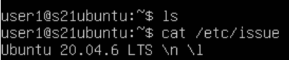
## Part 2. Создание пользователя
- Создание нового пользователя 

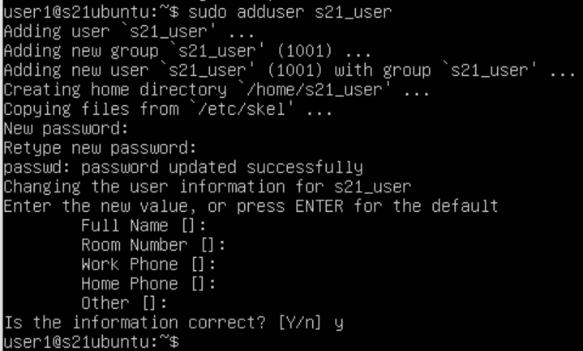
- Новый пользователь создается через `sudo adduser <username>`
  - Пароль и другие данные запрашиваются во время создание пользователя
- Добавление пользователя в группу `adm`, происходит через команду `sudo usermod -aG adm <username>`

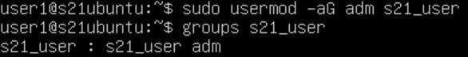
- `-a` Добавляет пользователя к дополнительной группе
- `-G` указывает список групп, в которые нужно добавить пользователя
- Группу пользователя можно посмотреть через `groups <username>`
- Вывод команды `cat /etc/passwd`:

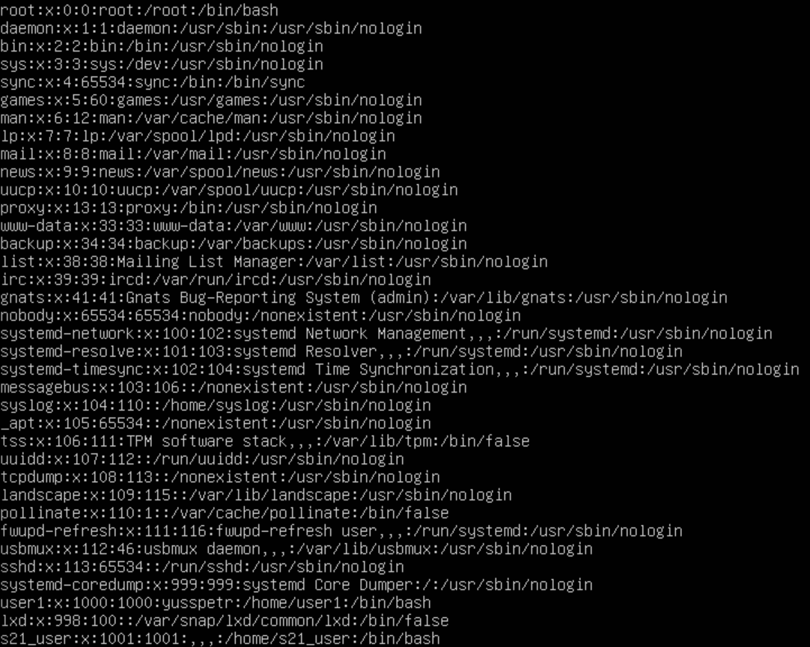
## Part 3. Настройка сети ОС
### Имя машины
- Имя машины можно поменять командой `sudo hostnamectl set-hostname <new_hostname>`
- Так же рекомендуется изменить файл `/etc/hosts` вручную, чтобы он содерал новое имя хоста
- Имя машины можно посмотреть через `hostnamectl`:

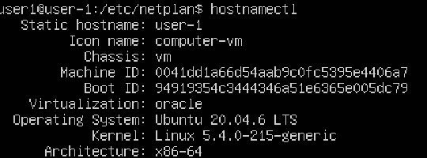
### Временная зона
- Временную зону задают через команду `sudo timedatectl set-timezone Asia/Yakutsk`
- Само время можно посмотреть командой `timedatectl`
### Сетевые интерфейсы
- Сетевые интерфейсы можно вывести через `ip l`
- lo - loopback интерфейс, используется для системной отправки сетевого трафика "на себя", это происходит между программами и на одном и том же компьютере, без использования физического сетевого оборудовния.
  - **Тестирования сетевых приложений**:
    - Программы используют адрес `127.0.0.1` чтобы взаимодействовать между собой
  - **Внутрення работа системы**: 
    - Некоторые служебные службы используют `lo` для внутренного обмена данными или проверки роботоспособности сетевого стека
  - **Изоляция**:
    - Сервисы могут быть настроекны, так чтобы слушать только `lo`, обеспечивая безопасность - они будут доступны только локально.
### Адрес IP устройства от DHCP
- Адрес айпи устройства можно посмотреть через команду `hostname -I` или через `ip a`, 
  - В случае `hostname -I` мы увидем только айпи адрес а в `ip a` мы увидем еще и сетевые интерфейсы
- **DHCP** (Dynamic Host Configuration Protocol) - Это сетевой протокол, используемый для автоматической выдачи IP адресов и других сетевых параметров устройствам в сети.
### Внешний и внутренний IP шлюза (gw)
- Внешний айпи шлюза можно посмотреть через команду `curl ifconfig.me`
- внутренний айпи адрес шлюза можно посмотреть через `ip route show default`
### Статическая настройки IP, gw, dns 
- Чтобы задать настройки вручную, без dhcp, надо изменить `yaml` файл в `/etc/netplan/`
  - чтобы изменения вступили в силу, надо использовать команду `sudo netplan apply`

- `dhcp` отключаем получение настроек через `DHCP`
- `gateway` адрес шлюза я посмотрел через `ip route`
- `IP` свободный айпи я нашел с помощью `ip -c 10.0.2.100`
- `nameservers` установил как посоветовали в задании

### Перезагрузка системы
- После перезагрузки все настройки сети остались

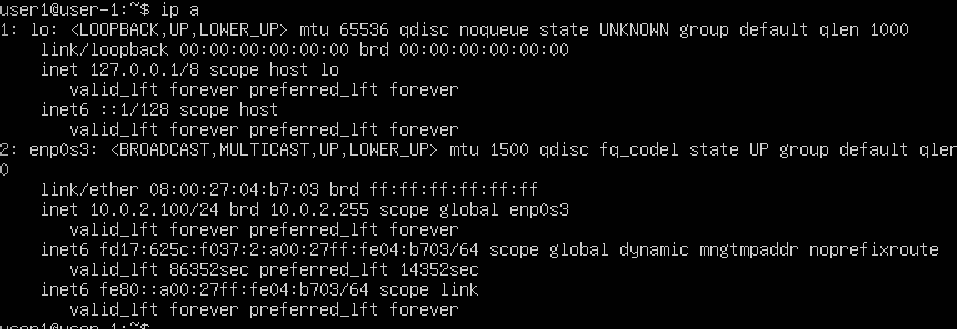
- Все пингуется без пакет лоссов

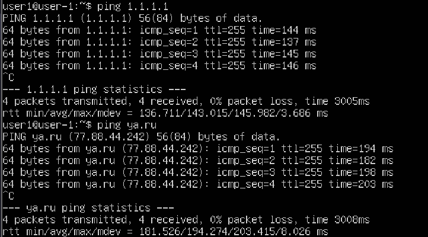
- Все семь этапов я описал поэтапно, в очередности того я как делал
## Part 4. Обновление ОС
- Для обновления системных пакетов сначала нужно обновить список пакетов, это делается через команду `sudo apt-get update && sudo apt-get upgrade`
- После обновления, повторный команда показывает:

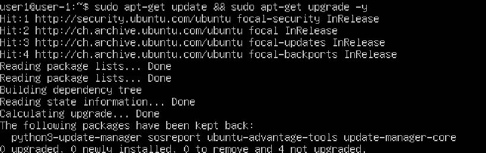
## Part 5. Использование команды sudo
- `sudo` - расшифровывается как "superuser do".
  - **Зачем используется**?
    - **Ограничение привелегий по умолчанию**: Для безопасности пользователь может временно получить права `root` для выполнения определенных команд.
    - **Контроль доступа**: Администратор может настроить, какие пользователи и какие команды могут выполнять через `sudo` (/etc/sudoers)
    - **Логирования**: Использование `sudo` логируется, что полезно для расследования инцидентов
- Изменил файл `hostname` через пользователя созданного раннее, так же я добавил этого пользователя в группу `sudo` через команду `sudo usermode -aG sudo s21_user`

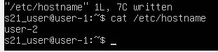
## Настройка службы времени
- Использовал команду `sudo timedatectl set-ntp true`, проверил через командой `timedatectl show`

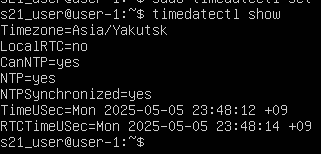
- Вывод был таким каким и должен быть
## Part 7. Установка и использование текстовых редакторов
### VIM
- vim, сделал файл через `vim test_vim.txt`

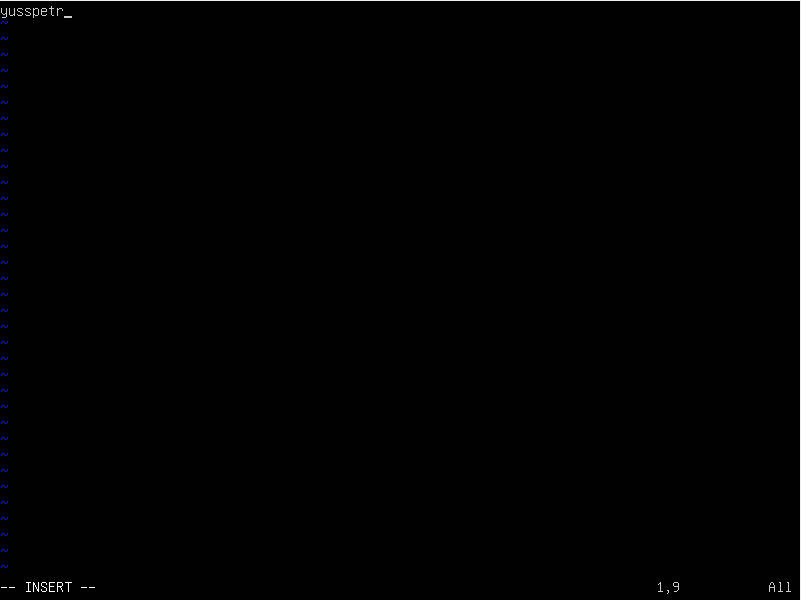
- Сохранил файл в виме через `:wq`, чтобы сохранить и выйти сразу
- Открыл файл еще раз и через `dd` удалил строку и заменил на `21 school 21` и вышел через `q!` без сохранений

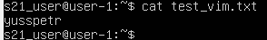
- Поиске в виме происходит через `/` и слово, например `/hello`

- Замена одного слово можно сделать через `ce` чтобы удалить и написать вместо слово что-то другое, замена всех встречающихся слов в файле происходит через `:$s/слово/новое_слово/g`
  - `g` озночает что нужно заменить глобально

  
  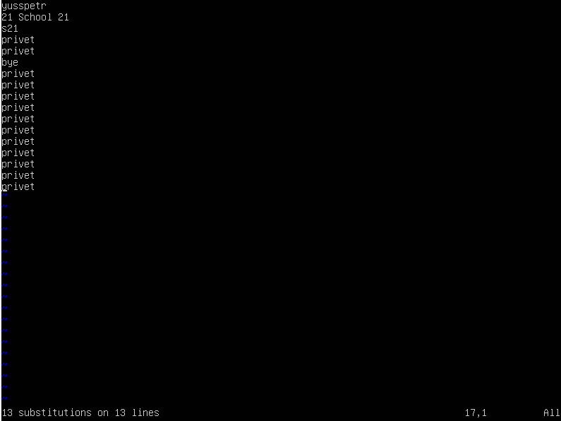
### Nano
- Сохранить файл `ctrl+o` подтердить и выйти через `ctrl+x`

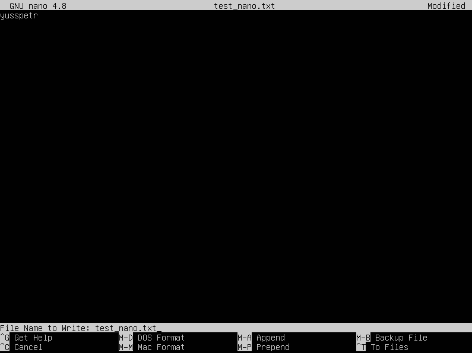
- Выйти через `ctrl+x` не подвердив сохранение, нажав n

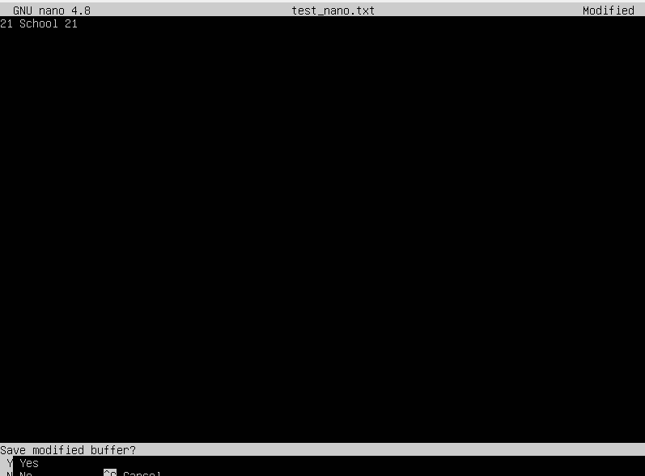
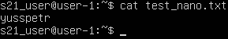
- Слова ищутся через `ctrl+w`

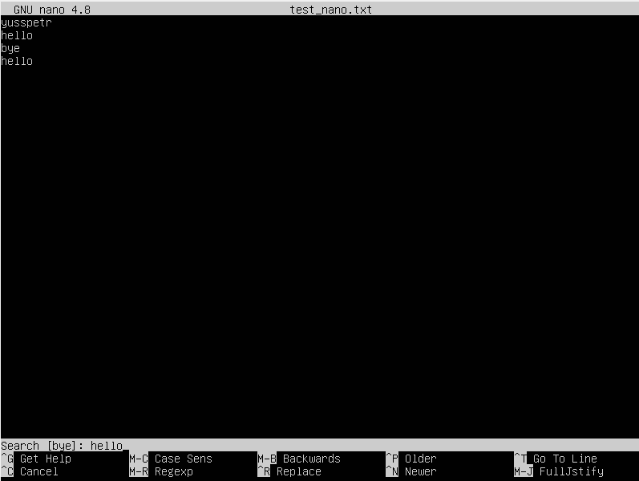
- слова заменяются через `ctrl+\` и сначала пишутся слова которые заменяются и потом уже слово на которое заменится старое слово

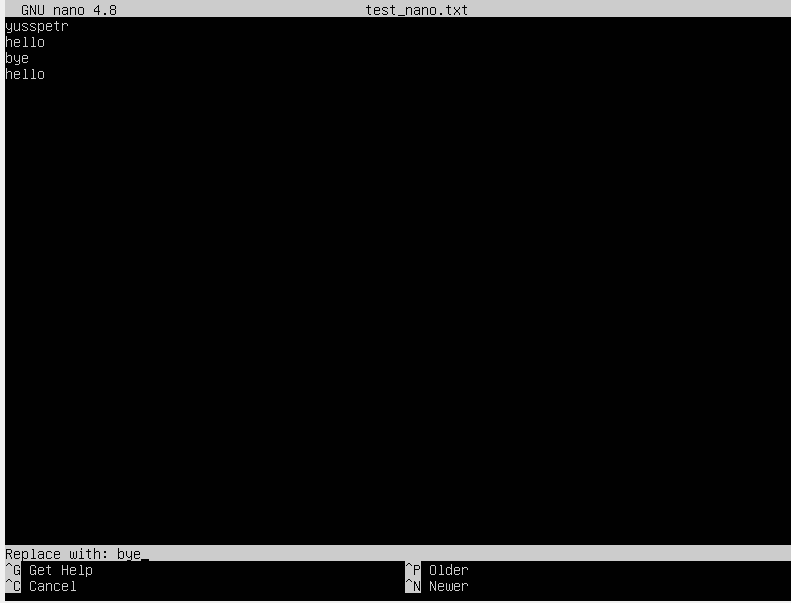
- На каждое замененное слово требуется подтверждение
### Emacs
- Файл сохраняется через комбинаци. клавиш `ctrl + x + s`

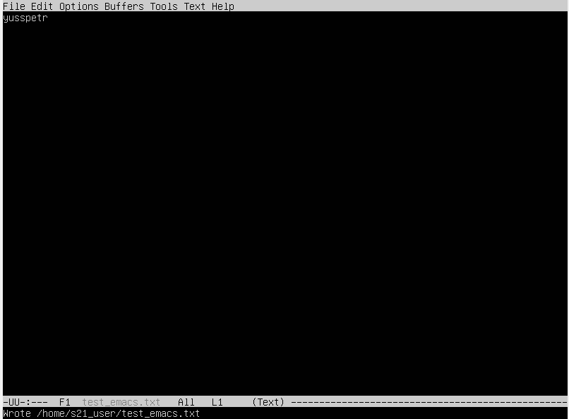
- Из emacs без сохранения можно выйти через комбинацию клавиш `ctrl + x + c` с нажатием n для отмены сохранения 

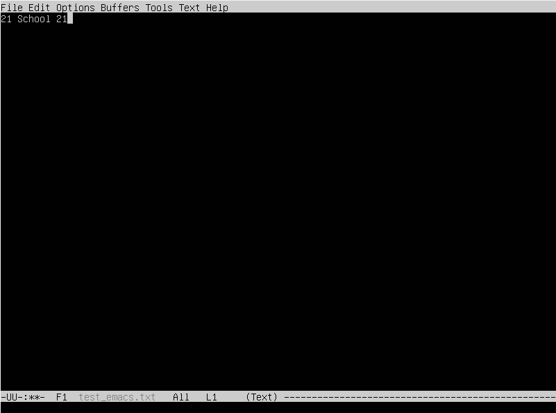
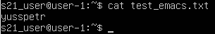
- поиск и замена происходит через `alt + %` и замена всех слов без подтверждения `!`

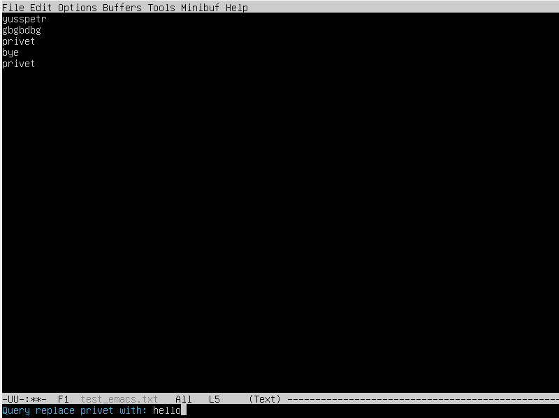
- обычный поиск `ctrl + s`

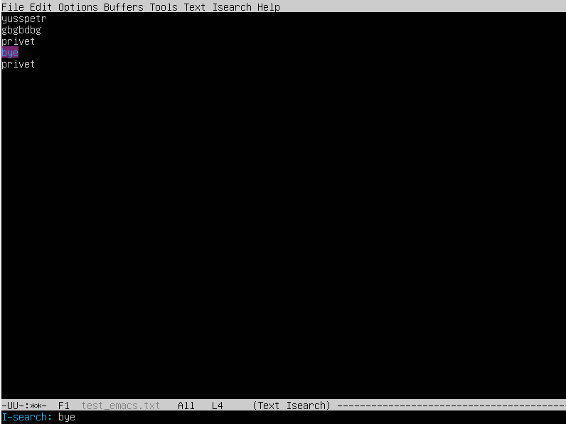
## Part 8. Установка и базовая настройка сервиса SSHD
- Установка службы SSHd: `sudo apt install openssh-server`, можно запустить руками если служба не стартанула `sudo systemctl start ssh`
- Добавляем в автозапуск: `sudo systemctl enable ssh`
  - Открываем через **sudo** файл **sshd_config**

  
  - Убрав комментарий с **Port**, устанавливаем его на **2022**

  
  - Перезапускаем службу через команду `sudo service sshd restart`
  - Вывод команды `ps -e | grep sshd`

  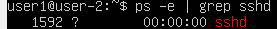
- `ps` команду отображает о всех запущенных процессах в системе.
- `-e` показывает только процессы текущего пользователф в текущей сессии
- `|` символ "пайп", он передает вывод предыдущей команды (`ps -e`) на вход следующей команде (`grep sshd`)
- `grep sshd` фильтрует строки на вывод `ps -e`, оставляя те, где встречаются слово `sshd`
- Вывод команды `netstat -tan`:

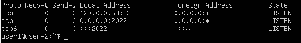
- ключ `-t` **(TCP)** - Показывает только соединение через протокол TCP
- ключ `-a` **(all)** - Отображает все активные и пассивные соединения
- ключ `-n` **(numerc)** - выводит адреса и порты в числовом виде
- proto - тип протокола 
- recv-Q - количество данных, ожидающего чтение из сокета(в очереди получение)
- send-Q - количество данных, ожидающих отправки через сокет(в очереди передачи)
- local address - локадльный ip адрес и порт, на котором раболтает сервис
- foreign address - удаленный ip адрес и порт, к которому устанвлено соединение
- state - текущее состояние соединение
## Part 9. Установка и использование утилит top, htop
### **top**:

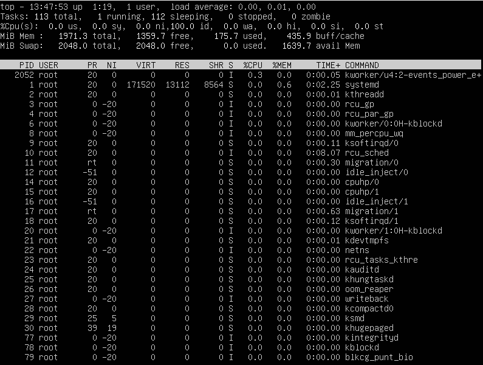
- Uptime: 1 час и 19 минут
- Количество авторизованных пользователей: 1
- Средняя загрузка системы (1/5/15 мин): 0.0 0.1 0.0
- Общее количество процессов: 113
- Текущая загрузка CPU: 0.0%
- Использование памяти: Total: 1971.5 MiB | Used: 175.7 MiB | Free: 1539.7 MiB
- PID процесса с наибольшим использованием памяти: 2052
- PID процесса с наибольшим использованием CPU: 2052
### htop 
- PID:

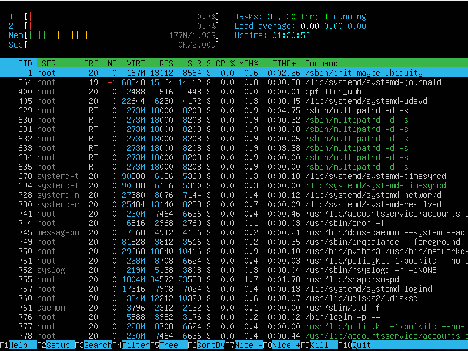
- PERCENT_CPU:

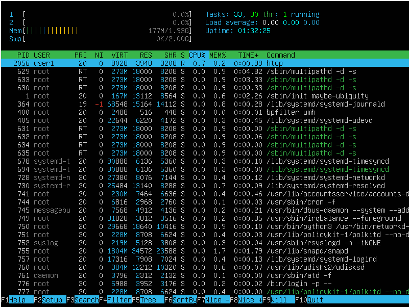
- PERCENT_MEM:

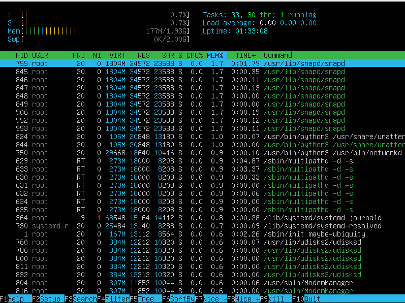
- TIME:

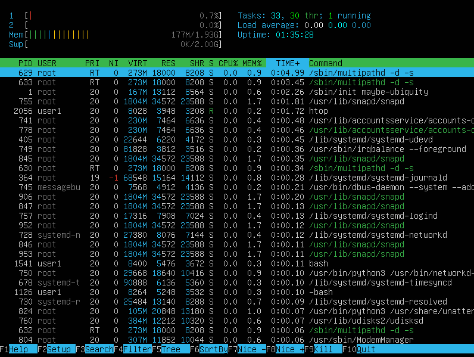
- фильтр по sshd:

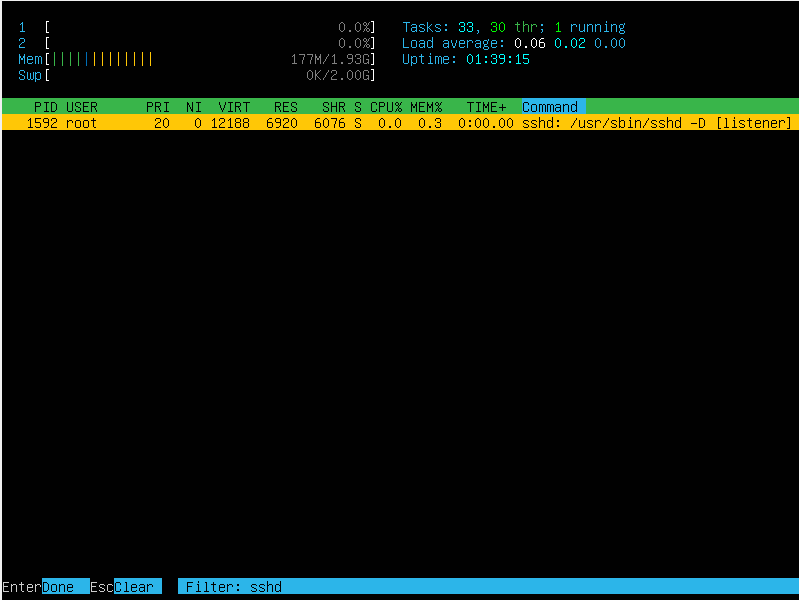
- поиск syslog:

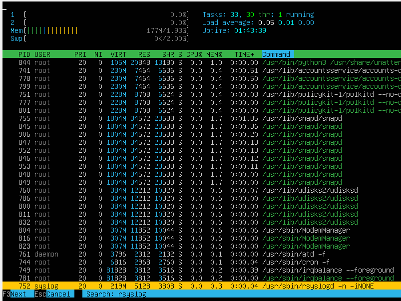
- добавлена hostname, clock, uptime:

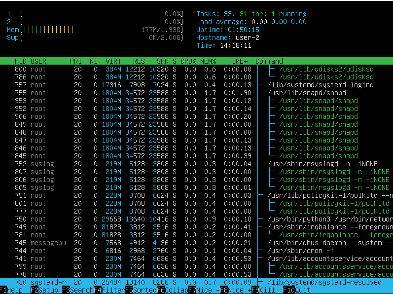
### Part 10. Использование утилиты fdisk
- Диск называетсы `sda`
  - Размер диска: 25Gb
  - Количество секторов 3:
    - sda1, sda2, sda3
  - Размер `swap`: 2Gb

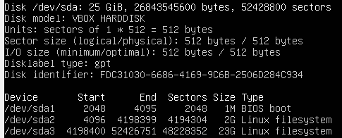
## Part 11. Использование утилиты df
### df

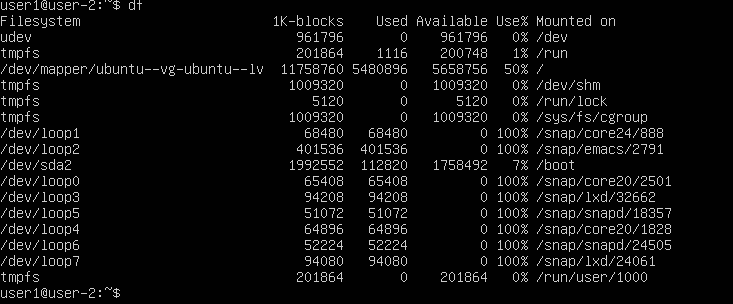
- Общий размер раздела `/`, состовляет 11758760 байт что равен 11.29 гигабайту
- Занятое пространство: 5480896 байт что состовляет 5.25 гигабайт
- Свободное пространство:5685756 байт что равно 5.34 гигабайту
- Процент использования: 50%
### df -Th

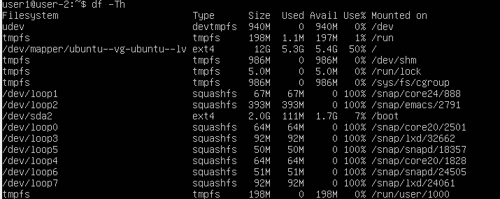
- Тип раздела для корневого раздела это `ext4`
- размер раздела: 12GB
- размер занятого пространства: 5.3GB
- размер свободного пространства: 5.4GB
- процент использования: 50%
## Part 12. Использование утилиты du
### `/home` 

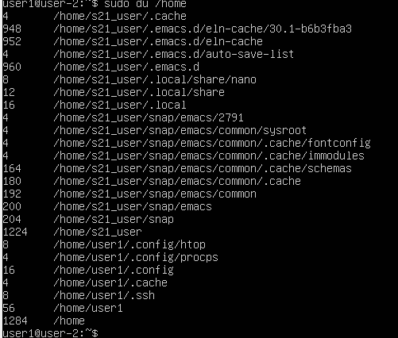
- Общий размер `/home` 1284 байтов
### `/var`

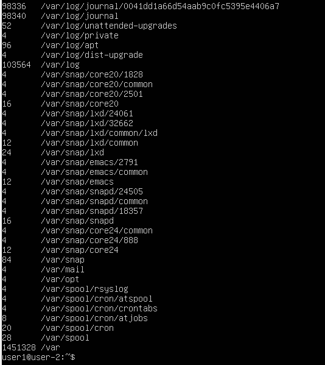
- Общий размер `/var` 1451328 байта
### `/var/log`

- Общий размер `/var/log` 103564 байта
### `/var/log/*`
- Все вложенные элементы 

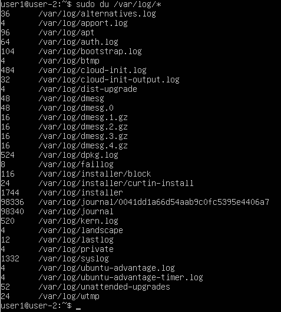
## Part 13. Установка и использование утилиты ncdu
- Установил утилиты через команду `sudo apt install ncdu`
- Вывод команду `ndcu /home`:

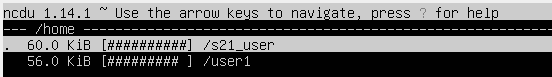
- вывод команды `ncdu /var`:

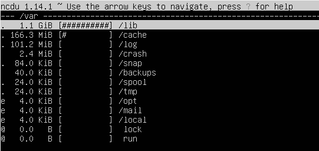
- вывод команды `ncdu /var/log`:

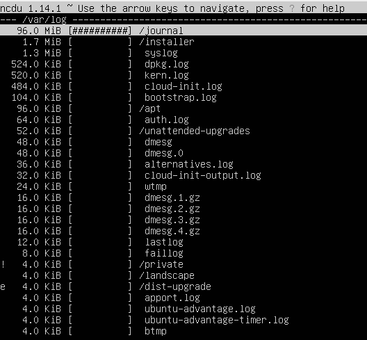
## Part 14. Работа с системными журналами
### Использование sudo
- Время последнего входа: `6 Мая 18:29:46`
- Имя пользователя: `root` для `user1`
- Метод входа: `sudo` 

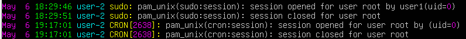
- `session closed` - парное сообщение с `session opened`, которое автоматическое создаются системой при начале завершение сессии
- Это значит `user1` использовал `root` для команды и система автоматически закрыла авторизацию `root`
### Последняя авторизация пользователя

- Время авторизации: `6 Мая 21:05:28`
- Имя пользователя: `s21_user`
- Метов входа: `su` 
### Перезапуск службы SSHd
- После перезапуска `sshd` через `sudo systemctl restart sshd`:

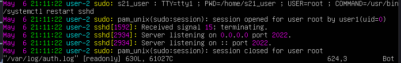
- Так же была авторизация под `root`, после перезапуска службы сессия была закрыта
- В `/var/log/syslog` находятся логи про перезапуск самой службы `sshd`

### Part 15. Использование планировщика заданий CRON
- Добавил в планировщик задач через `crontab -e`, выбрав вим : `*/2 * * * * /usr/bin/uptime >> /tmp/uptime.log 2>&1`

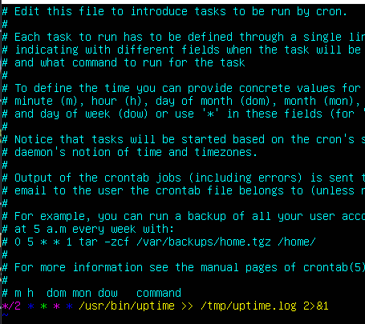
- Как и ожидлось каждые два минуты команда `uptime` работала

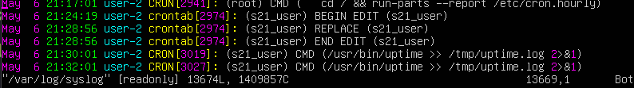
- Удалил из планировщика `crontab -e` текущую задачу

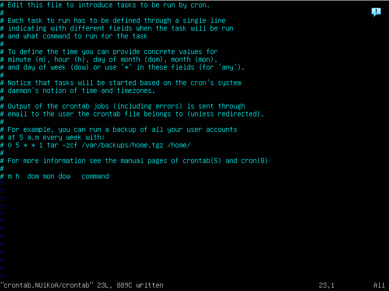